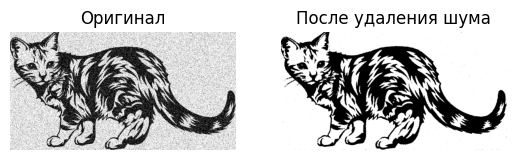

## Домашнее задание №1.
### Виноградова Анна. Группа: 25.М81-мм
#### 1 задание - перевод из RGB в HSV:


```python
def rgb_to_hsv(color):
    rgb = tuple(x/255 for x in color)
    rgb_min, rgb_max  = min(rgb), max(rgb)
    delta = rgb_max-rgb_min
    #Hue
    if (delta==0):
        h=0
    elif rgb_max == rgb[0]:
        h = 60 * ((rgb[1] - rgb[2]) / delta % 6)
    elif rgb_max == rgb[1]:
        h = 60 * ((rgb[2] - rgb[0]) / delta + 2)
    else:
        h = 60 * ((rgb[0] - rgb[1]) / delta + 4)

    #Saturation
    s = 0 if rgb_max==0 else delta/rgb_max

    return (h, s, rgb_max)
```

Результат работы функции:


```python
rgb_color = (255, 235, 255)
hsv_color = rgb_to_hsv(rgb_color)
print(f"RGB {rgb_color} - HSV {hsv_color}")
```

    RGB (255, 235, 255) - HSV (300.0, 0.07843137254901966, 1.0)
    

Проверка с ответом функции rgb_to_hsv библиотеки colorsys:


```python
import colorsys

r, g, b = (x/255 for x in rgb_color)
h, s, v = colorsys.rgb_to_hsv(r, g,  b)
print(f"colorsys:  RGB {rgb_color} - HSV {(h, s, v)}")
```

    colorsys:  RGB (255, 235, 255) - HSV (0.8333333333333334, 0.07843137254901966, 1.0)
    

#### 2 задание - удаление шума "соль-перец"


```python
import matplotlib.image as mpimg
import matplotlib.pyplot as plt
import numpy as np

img = mpimg.imread('4.jpg')
if img.ndim == 3:
    img = img[:, :, 0]

h, w = img.shape
array = np.zeros_like(img)

for i in range (h):
    for j in range (w):
        # берем окно 5х5
        window = img[i:i+5, j:j+5].flatten()
        sorted_vals = np.sort(window)
        array[i, j] = sorted_vals[len(sorted_vals)//2]

plt.subplot(1,2,1)
plt.title("Оригинал")
plt.imshow(img, cmap='gray')
plt.axis("off")

plt.subplot(1,2,2)
plt.title("После удаления шума")
plt.imshow(array, cmap='gray')
plt.axis("off")

plt.show()


```



    


